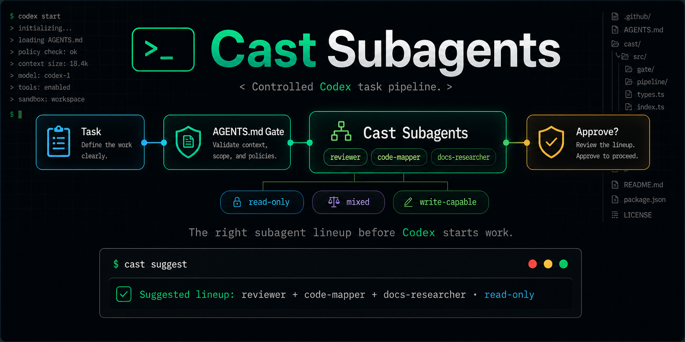
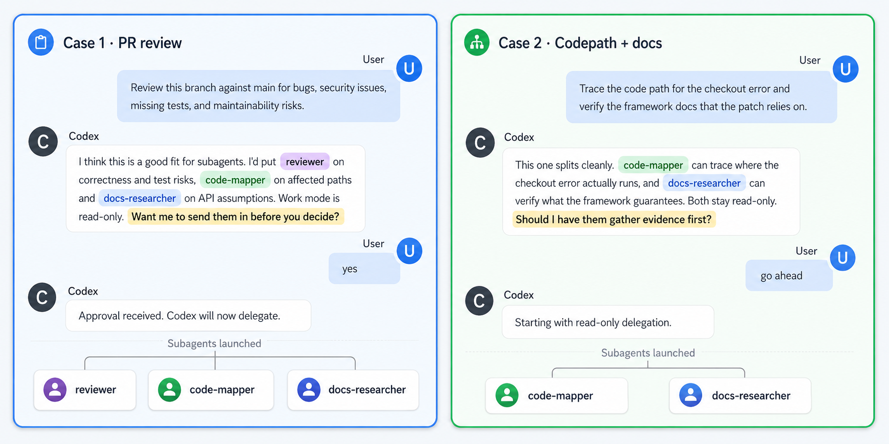

<h1 align="center">Cast-Subagents</h1>

<p align="center">
    <b>Codex 不会主动建议用子代理。Cast-Subagents 替你开这个口。</b>
</p>
<p align="center">
  <a href="README.md">English</a> | <a href="README.zh.md">简体中文</a>
</p>


<p align="center">
  <a href="LICENSE"></a>
  <a href="https://github.com/openai/codex"></a>
  <a href="https://github.com/917Dhj/cast-subagents/stargazers"></a>
  <a href="https://github.com/917Dhj/cast-subagents"></a>
  <a href="https://github.com/917Dhj/cast-subagents"></a>
  
</p>

<p align="center">
  
</p>
这种沉默是有代价的。每当一个任务天然地可以拆成多条独立线索——多维度的 PR 审查、代码路径加文档验证、有多条并行线程的选项调研——Codex 默认只会待在主线程里。你得自己察觉这个机会，自己决定派哪些角色，还得把委托请求写得足够清楚，Codex 才会执行。Cast-Subagents 做的就是这第一步识别：它发现那些适合委托的任务形态，在工作开始之前把阵容建议摆到你面前。

## 💬 效果预览

cast-subagents 识别任务形态、命名阵容和工作模式、提出一个直接的问题，然后停止。在你同意之前，它不会触碰任务本身。



## 🤔 为什么用 cast-subagents

OpenAI 自己的 Codex 文档中写道：*"Codex 不会自动生成子代理，只有在用户明确要求子代理或并行代理工作时才应使用子代理。"*

这句话描述了一个真实存在的缺口。对于每一个本可以从委托中受益的多维度任务，你都必须手动决定是否拆分、选择哪些角色、以及如何清晰地编写委托指令。随着上下文不断增长，主代理往往会自己包揽一切，而不是将工作分派出去。cast-subagents 通过前置分析来填补这个缺口——但它每次都把生成决策交回给你。

有些其他委托工具在分析之后会自动启动代理。cast-subagents 停在建议环节。这是一个刻意的设计选择：

| 其他自动启动工具 | cast-subagents |
|---|---|
| 分析任务，然后立即启动 | 分析任务，然后暂停等待批准 |
| 用户事后才看到委托 | 用户在操作之前就能看到建议的阵容 |
| 无需审查即消耗 Token | 你可以每次判断成本是否值得 |
| 工作流需要迁就工具 | 工具适配你已有的工作流 |

这在实践中意味着三个好处：

1. **你始终掌握最终决定权。** 子代理会成倍增加 Token 消耗。建议步骤让你可以根据具体情况决定是否值得。
2. **零工作流干扰。** 安装后可以保持原有的工作方式。建议在有用时出现；不需要时 Codex 正常运行。
3. **不会意外委托。** 如果主线程自己就能很好地处理某个任务，cast-subagents 会保持安静，而不是增加开销。

## ⚙️ 工作原理

cast-subagents 由两个按序协作的组件构成：

- **AGENTS.md 门控** 是始终在线的触发器。它在你的 Codex `AGENTS.md` 中添加一个简短的建议块，告诉 Codex 在开始任何非平凡工作之前检查是否适合子代理。
- **`SKILL.md`** 是建议引擎。当门控判断需要给出建议时，该技能负责详细工作：分类任务形态、选择 1-4 个角色的阵容、确定工作模式、编写建议消息。然后停止并等待。

可以把它们理解为门卫和顾问：门卫决定是否上报；顾问决定推荐什么。

```
用户发送任务
      │
      ▼
AGENTS.md 门控检查任务
      │
      ├── 任务简单 / 单一维度 / 已选择退出
      │         │
      │         ▼
      │     保持安静 → Codex 正常继续
      │
      └── 任务存在独立维度
                │
                ▼
          cast-subagents 技能
                │
                ▼
          分类任务形态
          选择阵容 (1-4 个角色)
          选择工作模式
          编写建议消息
                │
                ▼
          停止 — 等待批准
                │
      ┌─────────┴──────────┐
      │                    │
   拒绝                 批准
      │                    │
      ▼                    ▼
  在主线程中           按委托协议
  继续执行             分派子代理
```

### 建议契约

每条建议按顺序包含四个要素：为什么该任务可能受益于子代理、确切的阵容及每个角色的理由、工作模式、以及与工作风险相匹配的权限询问消息。输出是对话式的而非模板化的——同样的四个要素，每次措辞不同。

硬性约束：恰好一个阵容、不超过四个角色、批准前不涉及任务内容、不暗示委托已经开始。建议始终以一个问句结尾。

### 批准之后

你批准后，每个代理会收到结构化的委托信息，包含目标、成功标准、范围边界、相关文件路径、写入策略和可验证的交付物。以下是一个典型的委托内容：

```text
delegation_context: delegated-subagent; parent approval already completed; do not invoke cast-subagents or request another delegation approval; execute this handoff only
goal: Map the affected code path for the settings save failure.
success_criteria: Identify the real execution path, likely failure boundary,
  and the files that own the behavior.
scope_in: settings modal, client mutation, API route, response handling
scope_out: unrelated settings pages, styling, copy updates
relevant_paths: src/settings/, app/api/settings/, useSettingsForm
constraints: read-only; no code edits; cite concrete files and symbols
deliverable: concise summary with file references and one likely root cause
verification: parent can trace the same path from your references
write_policy: read-only
open_questions: whether retries or optimistic updates affect the failure mode
```

所有内容都是显式的，没有代理会从上下文中推断范围。完整协议见 `references/handoff-schema.md`。

## 📦 安装

### 通过 agent 安装（推荐）

告诉 Codex：

```
Fetch and follow instructions from https://raw.githubusercontent.com/917Dhj/cast-subagents/refs/heads/main/.codex/INSTALL.md
```

Codex 会用 `npx skills add` 安装技能、安装 AGENTS 门控，并可选择安装捆绑的代理角色——然后提示你重启。

### 手动安装

**1. 使用 npx Skills 为 Codex 安装技能：**

```bash
npx skills add 917Dhj/cast-subagents -a codex
```

如果命令弹出交互提示，请选择 Codex 作为目标代理。

**2. 安装 AGENTS 建议门控：**

```bash
# 全局安装 — 适用于所有 Codex 工作区（推荐）
python3 "${AGENTS_HOME:-$HOME/.agents}/skills/cast-subagents/scripts/install-agents-gate.py" --scope global

# 仅项目安装 — 仅适用于当前仓库
python3 "${AGENTS_HOME:-$HOME/.agents}/skills/cast-subagents/scripts/install-agents-gate.py" \
  --scope project \
  --path /path/to/repo
```

**3.（可选）安装捆绑的代理角色** — 将 7 个专业角色定义复制到你的 Codex 代理目录：

```bash
# 全局安装
python3 "${AGENTS_HOME:-$HOME/.agents}/skills/cast-subagents/scripts/install-agent-roles.py" --scope global

# 仅项目安装
python3 "${AGENTS_HOME:-$HOME/.agents}/skills/cast-subagents/scripts/install-agent-roles.py" \
  --scope project \
  --path /path/to/repo
```

不安装捆绑角色也没问题——cast-subagents 会使用 Codex 环境中已有的角色来推荐阵容。

**4. 重启 Codex**，使技能和 AGENTS 规则生效。

## 🧠 什么时候会触发建议

### 触发条件

- **跨越多领域的编排任务** — 任务涉及分离的关注点，可以并行探索或处理。

  > `Review this PR for correctness issues and verify that the API docs match
  >    the new endpoint behavior.`

- **需要外部知识或验证的代码分析** — 部分工作是对代码库内部的追踪，部分需要查阅框架文档或类似的外部参考。

  > `Find the bug in the retry logic and check the Stripe docs for the correct
  >    idempotency key behavior.`

- **需要并行研究来缩小范围** — 不确定问题在哪里，同时定位多条线索更快。

  > `Figure out why the staging deploy is failing — could be a config change,
  >    a missing migration, or a DNS issue.`

- **带有可分离子任务的宏观规划** — 任务是一个高层目标，包含清晰独立的调查路线。

  > `Map the relevant module boundaries first, then decide how to approach
  >    the change.`

### 保持安静的情况

- **琐碎或单文件变更** — 一行修复或重命名不需要委托。

  > `Fix this typo in the README.`

- **紧耦合的写入工作** — 涉及重叠逻辑的同文件变更，顺序执行更安全。

  > `就修这个单文件的小 bug，不要并行拆分。`

- **即时的事实查询** — 任务被一个答案阻塞，先生成子代理没有帮助。

  > `What port is the dev server using right now?`

- **明确选择退出** — 如果你说不要使用子代理，这是一个硬约束。

  > `Do not use subagents for this task.`

- **意图不明确的请求** — 如果意图不够清晰，无法构建可靠的阵容，技能会先要求澄清。

上面包含的中文示例是故意的。cast-subagents 在编写建议时会匹配用户使用的语言；角色名称和工作模式标签无论提示使用什么语言都保持英文。

## 🎭 角色与阵容

### 内置角色

`agents/categories/` 目录中包含七个专业角色：

| 角色 | 功能 |
|---|---|
| `code-mapper` | 追踪代码执行路径，定位文件归属关系 |
| `reviewer` | 识别变更中的正确性、安全和测试风险 |
| `docs-researcher` | 验证 API 保证和文档假设 |
| `search-specialist` | 在代码或外部资源中快速收集高信号证据 |
| `knowledge-synthesizer` | 将研究结果整合为简洁、可操作的总结 |
| `task-distributor` | 将宏观目标拆分为有边界、独立的子任务 |
| `test-automator` | 为已识别的风险区域添加最小回归测试覆盖 |

该技能先选择所需能力，然后映射到 Codex 环境中实际可用的角色。如果首选角色缺失，技能会明确说明，而非悄悄替换。

### 常见阵容

| 任务形态 | 推荐阵容 | 工作模式 |
|---|---|---|
| 多维度 PR 审查 | `reviewer + code-mapper + docs-researcher` | `read-only` |
| 代码路径加文档/API 验证 | `code-mapper + docs-researcher` | `read-only` |
| 方案研究与权衡综合 | `search-specialist + knowledge-synthesizer` | `read-only` |
| 以读取为主的代码库探索 | `code-mapper + search-specialist` | `read-only` |
| 回归风险证据收集 | `code-mapper + reviewer + search-specialist` | `read-only` |
| 有界修复前的探索 | `code-mapper + reviewer + worker` | `mixed` |
| 覆盖导向的后续跟进 | `reviewer + test-automator` | `write-capable` |

上限是四个角色。如果一个任务看起来需要更多角色，cast-subagents 要么压缩阵容，要么保持安静，而不是将其充数。

这些角色名称与 VoltAgent/awesome-codex-subagents 及类似社区 Codex 子代理集合兼容。如果你使用自定义角色集，可以修改 `references/role-lineups.md` 来添加自己的任务形态映射。

## 🔄 工作模式

**`read-only`**（只读）— 代理进行检查、追踪和报告。不写入文件。这是审查、映射、研究和验证任务的默认模式，也是 cast-subagents 在不确定时的首选。大多数建议使用此模式。

**`mixed`**（混合）— 代理以只读方式开始，在写入前暂停。技能会在确认探索阶段完成后，才将任务移交给有写入权限的代理。当你在建议中看到 `mixed` 时，意思是："我们先深入探索，在修改任何内容之前我会跟你确认。"

**`write-capable`**（可写入）— 代理可以在分配的范围内编辑文件。cast-subagents 会明确标记此模式，并在权衡值得说明时，提供以只读模式开始的选项。任何包含 `test-automator` 的阵容默认使用此模式。

模式始终以这三个确切标签之一声明——你不会在不知道工作模式的情况下看到建议。

## ❓ 常见问题

**为什么不能自动生成子代理？**

这是刻意的设计选择，而非限制。子代理会成倍增加 Token 消耗，而正确的决策因任务而异。批准步骤让你每次都可以权衡成本，而不是无条件地承诺。此领域的其他工具会让生成自动化；cast-subagents 将你的批准视为必需步骤。

**在简单任务上会拖慢 Codex 吗？**

不会。AGENTS 门控会在响应前检查每个任务，但对于简单、单一领域或单文件的工作，它完全保持安静。对于不值得建议的任务，你不会看到任何提示。

**如果我只是这次想跳过建议呢？**

在提示中包含类似"do not use subagents"或"no subagents"的短语。门控将显式选择退出视为硬性约束。你也可以在建议出现时直接拒绝——cast-subagents 会在主线程中继续执行，除非任务发生实质性变化，否则不会再次建议。

**是否兼容自定义子代理集合？**

是的。首选角色名称与 VoltAgent/awesome-codex-subagents 等集合兼容。如果你使用自定义角色集，可以编辑 `references/role-lineups.md` 来添加自己的任务形态映射。cast-subagents 会使用可用的角色，并在首选角色缺失时明确说明。

**它会编辑我的代码吗？**

不会。cast-subagents 产生建议并等待。即使在批准后，生成操作也由 Codex 处理——cast-subagents 在任何时候都不会触碰你的文件。

**是否支持非英文提示？**

支持。cast-subagents 在编写建议时会匹配你的语言。角色名称和工作模式标签保持英文（作为精确标记），但周围消息会跟随你提示的语言。中文开箱即用。

**我可以自定义哪些任务形态会触发建议吗？**

可以。`references/decision-rules.md` 是任务形态分类的权威来源。`references/role-lineups.md` 控制阵容推荐。两者都是纯 Markdown 表格——直接编辑它们来添加、删除或调整规则。无需学习配置语言。

## 🗂 项目结构

```text
cast-subagents/
├── SKILL.md                      # 核心建议技能
├── .codex/
│   └── INSTALL.md                # 代理可读的安装说明
├── agents/
│   ├── openai.yaml               # 技能接口定义
│   └── categories/
│       ├── 01-core/
│       │   └── code-mapper.toml
│       ├── 02-research/
│       │   ├── docs-researcher.toml
│       │   ├── knowledge-synthesizer.toml
│       │   └── search-specialist.toml
│       ├── 03-planning/
│       │   └── task-distributor.toml
│       └── 04-quality/
│           ├── reviewer.toml
│           └── test-automator.toml
├── references/
│   ├── decision-rules.md         # 任务形态 → 建议/静默 映射
│   ├── role-lineups.md           # 任务形态 → 阵容推荐
│   ├── suggestion-contract.md    # 输出格式和语气规则
│   ├── handoff-schema.md         # 批准后的委托数据结构
│   ├── examples-positive.md      # 应触发建议的任务示例
│   └── examples-negative.md      # 应保持安静的任务示例
├── scripts/
│   ├── install-agents-gate.py    # 管理 AGENTS.md 触发器块
│   └── install-agent-roles.py    # 将捆绑的 .toml 文件复制到 Codex 代理目录
├── evals/
│   ├── prompts.yaml
│   ├── rubric.md
│   ├── scenarios.md
│   └── results/
└── CHANGELOG.md
```

`references/` 目录是实际改动发生的地方。`SKILL.md` 在运行时加载这些引用，因此你可以在不触及技能逻辑本身的情况下调整决策规则、阵容表和措辞。

## 🙏 致谢

本项目的"始终在线门控"模式与 session-bootstrap 思路参考自 [obra/superpowers](https://github.com/obra/superpowers)。"通过 session bootstrap 机制确保门控在每个任务前运行"这一思路直接来自对该项目的学习。

仓库内置的角色包是从 [VoltAgent/awesome-codex-subagents](https://github.com/VoltAgent/awesome-codex-subagents) 中整理出来的一小部分精选角色。它只包含 cast-subagents 常用推荐的角色，并围绕本 skill 的决策规则做了轻量组织，并不是对该集合的完整镜像。

## 🤝 贡献与许可

欢迎提交 Issue 和 Pull Request。最有价值的贡献包括：

- 在 `references/decision-rules.md` 中添加新的任务形态，并在 `references/role-lineups.md` 中匹配相应的阵容
- 在 `references/examples-positive.md` 和 `references/examples-negative.md` 中添加正面和负面示例，用真实提示验证新规则
- 在 `evals/scenarios.md` 中添加评估场景，覆盖当前规则可能产生意外结果的边界情况

添加决策规则时，有用的测试是：能否写出一个应该触发它的提示，以及一个看起来相似但应该保持安静的提示？如果两者都在示例文件中，说明规则的边界是清晰的。

本项目基于 [MIT License](LICENSE) 发布。
