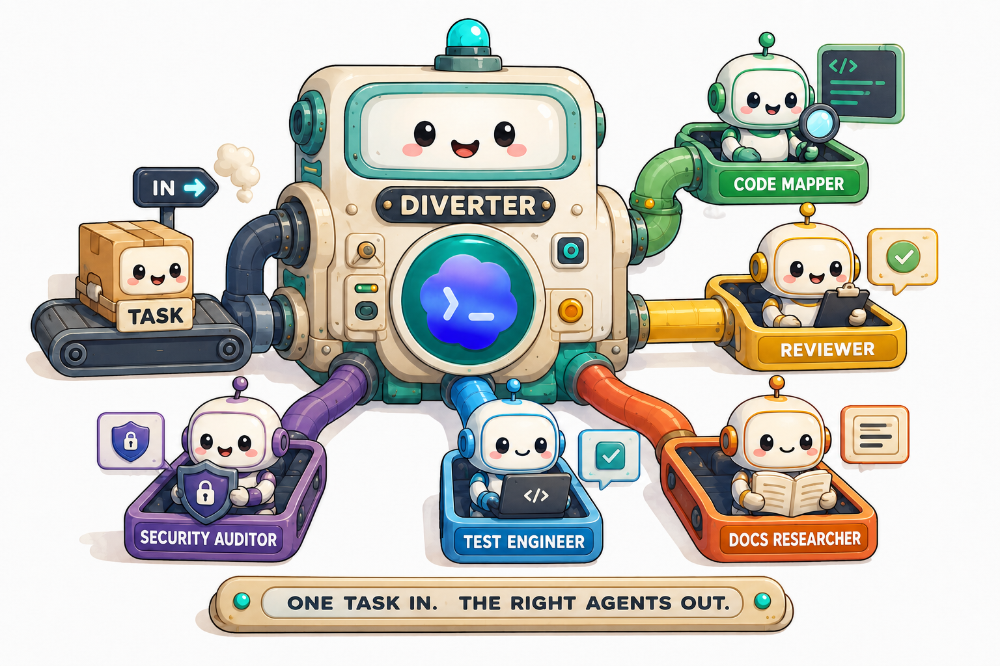

<h1 align="center">Diverter</h1>

<p align="center">
    <b>一个任务进入，正确的子代理出发</b>
</p>
<p align="center">
  <a href="README.md">English</a> | <a href="README.zh.md">简体中文</a>
</p>


<p align="center">
  <a href="LICENSE"></a>
  <a href="https://github.com/openai/codex"></a>
  <a href="https://github.com/917Dhj/diverter/stargazers"></a>
  <a href="https://github.com/917Dhj/diverter"></a>
  <a href="https://github.com/917Dhj/diverter"></a>
  
</p>

<p align="center">
  
</p>
在未启用原生主动委派的会话中，这种沉默是有代价的。每当一个任务天然地可以拆成多条独立线索——多维度的 PR 审查、代码路径加文档验证、有多条并行线程的选项调研——Codex 默认只会待在主线程里。你得自己察觉这个机会，自己决定派哪些角色，还得把委托请求写得足够清楚，Codex 才会执行。Diverter 做的就是这第一步识别：它发现那些适合委托的任务形态，在工作开始之前把阵容建议摆到你面前。

它不仅判断任务是否适合拆分，还会根据任务信号推荐合适的专业角色阵容，例如代码路径追踪、PR 审查、文档核验、安全审计、测试策略、回归测试、Web 性能审计和发布前质量门。

## 💬 效果预览

Diverter 识别任务形态、命名阵容和工作模式、提出一个直接的问题，然后停止。在你同意之前，它不会触碰任务本身。


## 🤔 为什么用 Diverter

新版 Codex 有两条路径：在大多数 intelligence 档位下，委派仍需用户明确提出；在 Ultra 下，原生主动委派可以自动启动适合并行处理的工作。参见 OpenAI 的[子代理文档](https://learn.chatgpt.com/docs/agent-configuration/subagents)。

Diverter 只填补第一条路径的缺口：提前完成分析，但把是否启动代理的决定交还给你。当更高优先级的会话策略启用原生主动委派时，Diverter 会静默让路——即使被显式调用也一样——由原生策略独占编排权。

有些其他委托工具在分析之后会自动启动代理。Diverter 停在建议环节。这是一个刻意的设计选择：

| 其他自动启动工具 | Diverter |
|---|---|
| 分析任务，然后立即启动 | 分析任务，然后暂停等待批准 |
| 用户事后才看到委托 | 用户在操作之前就能看到建议的阵容 |
| 无需审查即消耗 Token | 你可以每次判断成本是否值得 |
| 工作流需要迁就工具 | 工具适配你已有的工作流 |

这在实践中意味着三个好处：

1. **你始终掌握最终决定权。** 子代理会成倍增加 Token 消耗。建议步骤让你可以根据具体情况决定是否值得。
2. **零工作流干扰。** 安装后可以保持原有的工作方式。建议在有用时出现；不需要时 Codex 正常运行。
3. **不会意外委托。** 如果主线程自己就能很好地处理某个任务，Diverter 会保持安静，而不是增加开销。

## 📦 安装

告诉 Codex：

```
请获取并按照这个安装说明执行：https://raw.githubusercontent.com/917Dhj/diverter/refs/heads/main/.codex/INSTALL.md
```

安装说明是唯一支持的入口。Codex 会添加仓库 marketplace、安装 `diverter@diverter`、展示完整的 GPT-5.6 角色表、把你选中的角色安装到全局 Codex Agent 目录，然后请你信任 `SessionStart` Hook。你不需要手动运行角色安装脚本。安装完成后新建一个任务即可。

## 🎭 角色与阵容

### 内置角色

`agents/categories/` 目录中包含十个专业角色。安装编号保持稳定；未来新增角色只分配新编号，不复用已有编号。

| 编号 | 角色 | GPT-5.6 模型 | Reasoning effort | 功能 |
|---:|---|---|---|---|
| 1 | `code-mapper` | `gpt-5.6-terra` | `high` | 追踪代码路径、文件、符号和归属边界 |
| 2 | `search-specialist` | `gpt-5.6-luna` | `medium` | 收集聚焦的仓库或外部证据 |
| 3 | `docs-researcher` | `gpt-5.6-luna` | `high` | 核验官方 API、版本和文档保证 |
| 4 | `knowledge-synthesizer` | `gpt-5.6-luna` | `high` | 对齐冗长或冲突的结果，不臆造事实 |
| 5 | `task-distributor` | `gpt-5.6-sol` | `medium` | 将宽泛目标拆成有边界的工作包 |
| 6 | `reviewer` | `gpt-5.6-sol` | `medium` | 审查正确性、回归、契约和可维护性 |
| 7 | `security-auditor` | `gpt-5.6-sol` | `high` | 审计信任边界、认证、密钥和 agent tool 安全 |
| 8 | `test-engineer` | `gpt-5.6-luna` | `xhigh` | 针对行为和风险设计最小测试覆盖 |
| 9 | `test-automator` | `gpt-5.6-terra` | `xhigh` | 在行为明确后添加有边界的回归测试 |
| 10 | `web-performance-auditor` | `gpt-5.6-luna` | `xhigh` | 审计 Web 性能证据和 Core Web Vitals 风险 |

推荐安装组合为角色 `1,3,6,7,8,9`。通过 Agent 安装时可以选择推荐组合、全部角色或任意自定义组合，并会在覆盖选中的同名文件前明确提示。

该技能先选择所需能力，然后映射到 Codex 环境中实际可用的角色。如果首选角色缺失，技能会明确说明，而非悄悄替换。

专业角色不是用来凑阵容的。只有当任务中出现清晰、独立的安全、测试、性能或发布风险信号时，Diverter 才会把对应角色加入阵容。

### 常见阵容

| 任务形态 | 推荐阵容 | 工作模式 |
|---|---|---|
| 通用 PR 审查 | `reviewer + code-mapper` | `read-only` |
| 安全敏感审查 | `security-auditor + code-mapper + reviewer` | `read-only` |
| 测试覆盖分析 | `test-engineer + code-mapper` | `read-only` |
| 有针对性的回归测试 | `test-engineer + test-automator + code-mapper` | `mixed` |
| Web 性能审计 | `web-performance-auditor + code-mapper` | `read-only` |
| 发布前质量门 | `reviewer + security-auditor + test-engineer + code-mapper` | `read-only` |
| 代码路径加文档/API 验证 | `code-mapper + docs-researcher` | `read-only` |
| 方案研究与权衡综合 | `search-specialist + knowledge-synthesizer` | `read-only` |

专项示例：

| 任务形态 | 推荐阵容 | 工作模式 |
|---|---|---|
| 认证 / 权限 / token 流程审查 | `security-auditor + code-mapper` | `read-only` |
| LLM / agent tool 安全审查 | `security-auditor + code-mapper + docs-researcher` | `read-only` |
| 带指标材料的 Web 性能审计 | `web-performance-auditor` | `read-only` |
| 有针对性的回归测试 | `test-engineer + test-automator + code-mapper` | `mixed` |

上限是四个角色。如果一个任务看起来需要更多角色，Diverter 要么压缩阵容，要么保持安静，而不是将其充数。

这些角色名称与 VoltAgent/awesome-codex-subagents 及类似社区 Codex 子代理集合兼容。如果你使用自定义角色集，可以修改 `skills/diverter/references/role-lineups.md` 来添加自己的任务形态映射。

## 🔄 工作模式

**`read-only`**（只读）— 代理进行检查、追踪和报告。不写入文件。这是审查、映射、研究和验证任务的默认模式，也是 Diverter 在不确定时的首选。大多数建议使用此模式。

**`mixed`**（混合）— 代理以只读方式开始，在写入前暂停。技能会在确认探索阶段完成后，才将任务移交给有写入权限的代理。当你在建议中看到 `mixed` 时，意思是："我们先深入探索，在修改任何内容之前我会跟你确认。"

**`write-capable`**（可写入）— 代理可以在分配的范围内编辑文件。Diverter 只在明确需要可写工作的场景使用它。测试写入任务通常先从 `mixed` 开始：由 `test-engineer` 和 `code-mapper` 明确行为边界，再由 `test-automator` 在范围清楚后添加有针对性的测试。

模式始终以这三个确切标签之一声明——你不会在不知道工作模式的情况下看到建议。

## 🧠 什么时候会触发建议

### 触发条件

Diverter 会看两类信号：核心委托信号，说明任务可以拆成独立线索；专业角色信号，说明某个具体风险需要专门角色处理。

**核心委托信号**

- **多维度审查** — 同一个 diff 或分支需要从多个独立角度审查。

  > `Review this branch against main for bugs, security issues, missing tests, and maintainability risks.`

- **以读取为主的代码路径追踪** — 修改前需要先摸清多个路径或层级。

  > `Map the auth flow first, then tell me whether the current implementation is safe to change.`

- **代码路径加文档/API 核验** — 同时需要代码追踪和文档确认，且两条线索可以并行。

  > `先帮我查清楚代码路径，再去核对官方文档里这个 API 的行为。`

- **可并行的资料研究** — 任务包含彼此不阻塞的独立问题。

  > `Research three approaches for background job retries and summarize the tradeoffs before we choose one.`

- **带有可分离子任务的宏观规划** — 任务是高层目标，包含清晰独立的调查路线。

  > `Map the relevant module boundaries first, then decide how to approach the change.`

**专业角色信号**

- **安全边界** — 认证、授权、密钥、用户输入、webhook、依赖或 LLM/tool 权限风险是任务核心。

  > `Review this auth refactor for permission bypasses, token handling issues, and missing server-side checks.`

- **测试策略或有界回归测试** — 任务询问缺哪些测试、如何证明 bug 修复，或如何添加有边界的回归覆盖。

  > `Look at the checkout flow and tell me what tests are missing before we change anything.`

- **Web 性能** — 任务涉及前端路由、Core Web Vitals、Lighthouse、LCP、INP、CLS、加载、渲染或网络行为。

  > `Audit the Next.js landing page for LCP, INP, CLS, image loading, and unnecessary client-side rendering.`

- **发布前质量门** — 任务要求从代码质量、测试、安全和风险角度判断是否可发布。

  > `Before we ship this branch, check code quality, security risk, and missing tests.`

- **LLM 或 agent tool 安全** — 任务涉及 prompt injection、工具权限、上下文密钥、子代理委托或破坏性工具调用。

  > `Check whether this agent tool integration can leak secrets or let a subagent perform destructive actions without approval.`

### 保持安静的情况

- **琐碎或单文件变更** — 一行修复或重命名不需要委托。

  > `Fix this typo in the README.`

- **紧耦合的写入工作** — 涉及重叠逻辑的同文件变更，顺序执行更安全。

  > `就修这个单文件的小 bug，不要并行拆分。`

- **即时的事实查询** — 任务被一个答案阻塞，先生成子代理没有帮助。

  > `What port is the dev server using right now?`

- **明确选择退出** — 如果你说不要使用子代理，这是一个硬约束。

  > `Do not use subagents for this task.`

- **意图不明确的请求** — 如果意图不够清晰，无法构建可靠的阵容，技能会先要求澄清。

上面包含的中文示例是故意的。Diverter 在编写建议时会匹配用户使用的语言；角色名称和工作模式标签无论提示使用什么语言都保持英文。

## ⚙️ 工作原理

Diverter 由三个按序协作的组件构成：

- **`SessionStart` Hook** 为根会话激活一个简短的建议门控。它会在启动、恢复、清空和上下文压缩后恢复，不修改任何指令文件。
- **Skill** 是建议引擎。它会先检查更高优先级的会话策略；若原生主动委派已启用，就静默让路。否则，当门控判断需要给出建议时，它负责分类任务形态、选择 1-4 个角色的阵容、确定工作模式、编写建议消息，然后停止并等待。
- **执行后端** 运行已批准的 handoff。若 spawn 接口暴露角色与模型控制，Codex 使用原生自定义 Agent；否则使用临时 `codex exec` worker，并保留角色的模型、effort、sandbox、instructions 和实时 Web Search。

CLI worker 是叶子 Agent：多代理功能会被关闭，不能继续委托。

```
用户发送任务
      │
      ▼
SessionStart Hook 激活建议门控
      │
      ├── 原生主动委派已启用
      │         │
      │         ▼
      │     静默让路 → 原生策略继续
      │
      ├── 任务简单 / 单一维度 / 已选择退出
      │         │
      │         ▼
      │     保持安静 → Codex 正常继续
      │
      └── 任务存在独立维度
                │
                ▼
          Diverter 技能
                │
                ▼
          分类任务形态
          选择阵容 (1-4 个角色)
          选择工作模式
          编写建议消息
                │
                ▼
          停止 — 等待批准
                │
      ┌─────────┴──────────┐
      │                    │
   拒绝                 批准
      │                    │
      ▼                    ▼
  在主线程中           选择原生或 CLI
  继续执行             worker 后端
```

### 建议契约

每条建议按顺序包含四个要素：为什么该任务可能受益于子代理、确切的阵容及每个角色的理由、工作模式、以及与工作风险相匹配的权限询问消息。输出是对话式的而非模板化的——同样的四个要素，每次措辞不同。

硬性约束：恰好一个阵容、不超过四个角色、批准前不涉及任务内容、不暗示委托已经开始。建议始终以一个问句结尾。

### 批准之后

你批准后，每个代理会收到结构化的委托信息，包含目标、成功标准、范围边界、相关文件路径、写入策略和可验证的交付物。以下是一个典型的委托内容：

```text
delegation_context: delegated-subagent; parent approval already completed; do not invoke diverter or request another delegation approval; execute this handoff only
goal: Map the affected code path for the settings save failure.
success_criteria: Identify the real execution path, likely failure boundary,
  and the files that own the behavior.
scope_in: settings modal, client mutation, API route, response handling
scope_out: unrelated settings pages, styling, copy updates
relevant_paths: src/settings/, app/api/settings/, useSettingsForm
constraints: read-only; no code edits; cite concrete files and symbols
deliverable: concise summary with file references and one likely root cause
verification: parent can trace the same path from your references
write_policy: read-only
open_questions: whether retries or optimistic updates affect the failure mode
```

所有内容都是显式的，没有代理会从上下文中推断范围。完整协议见 `skills/diverter/references/handoff-schema.md`。

## ❓ 常见问题

**为什么不能自动生成子代理？**

这是刻意的设计选择，而非限制。子代理会成倍增加 Token 消耗，而正确的决策因任务而异。批准步骤让你每次都可以权衡成本，而不是无条件地承诺。此领域的其他工具会让生成自动化；Diverter 将你的批准视为必需步骤。

**Codex 启用原生主动委派时会怎样？**

Diverter 会静默让路，即使被显式调用也一样。它不会建议阵容、请求批准或启动执行后端；该任务由原生策略拥有编排权。

**在简单任务上会拖慢 Codex 吗？**

不会。`SessionStart` Hook 只在根会话生命周期事件中加载一次建议门控；对于简单、单一领域或单文件工作，门控会保持安静。

**如果我只是这次想跳过建议呢？**

在提示中包含类似"do not use subagents"或"no subagents"的短语。门控将显式选择退出视为硬性约束。你也可以在建议出现时直接拒绝——Diverter 会在主线程中继续执行，除非任务发生实质性变化，否则不会再次建议。

**是否兼容自定义子代理集合？**

是的。首选角色名称与 VoltAgent/awesome-codex-subagents 等集合兼容。如果你使用自定义角色集，可以编辑 `skills/diverter/references/role-lineups.md` 来添加自己的任务形态映射。Diverter 会使用可用的角色，并在首选角色缺失时明确说明。

**它会编辑我的代码吗？**

建议阶段不会编辑代码。批准后，获批的 write-capable 角色可以在明确 handoff 与 sandbox 范围内修改文件；read-only 角色仍保持只读。

**是否支持非英文提示？**

支持。Diverter 在编写建议时会匹配你的语言。角色名称和工作模式标签保持英文（作为精确标记），但周围消息会跟随你提示的语言。中文开箱即用。

**我可以自定义哪些任务形态会触发建议吗？**

可以。`skills/diverter/references/decision-rules.md` 是任务形态分类的权威来源。`skills/diverter/references/role-lineups.md` 控制阵容推荐。两者都是纯 Markdown 表格——直接编辑它们来添加、删除或调整规则。无需学习配置语言。

## 🗂 项目结构

```text
diverter/
├── .codex-plugin/
│   └── plugin.json               # 插件清单
├── .agents/plugins/
│   └── marketplace.json          # 单插件 marketplace
├── .codex/
│   └── INSTALL.md                # 代理可读的安装说明
├── hooks/
│   ├── hooks.json                # SessionStart 注册
│   └── session_start.py          # 无状态建议门控输出
├── skills/diverter/
│   ├── SKILL.md                  # 核心建议 skill
│   └── references/               # 规则、阵容、示例和 handoff 协议
├── agents/
│   ├── openai.yaml               # 技能接口定义
│   └── categories/
│       ├── 01-core/
│       │   └── code-mapper.toml
│       ├── 02-research/
│       │   ├── docs-researcher.toml
│       │   ├── knowledge-synthesizer.toml
│       │   └── search-specialist.toml
│       ├── 03-planning/
│       │   └── task-distributor.toml
│       └── 04-quality/
│           ├── reviewer.toml
│           ├── security-auditor.toml
│           ├── test-engineer.toml
│           ├── test-automator.toml
│           └── web-performance-auditor.toml
├── scripts/
│   ├── install-agent-roles.py    # 全局安装内置角色
│   └── run-cli-agent.py          # 运行一个临时叶子 CLI worker
├── evals/
│   ├── prompts.yaml
│   ├── rubric.md
│   ├── scenarios.md
│   └── results/
└── CHANGELOG.md
```

Skill 下的 `references/` 目录是策略改动发生的地方。`SKILL.md` 在运行时加载这些引用，因此你可以在不触及技能逻辑本身的情况下调整决策规则、阵容表和措辞。

## 🙏 致谢

本项目的"始终在线门控"模式与 session-bootstrap 思路参考自 [obra/superpowers](https://github.com/obra/superpowers)。"通过 session bootstrap 机制确保门控在每个任务前运行"这一思路直接来自对该项目的学习。

仓库内置的角色包是从 [VoltAgent/awesome-codex-subagents](https://github.com/VoltAgent/awesome-codex-subagents) 中整理出来的一小部分精选角色。它只包含 Diverter 常用推荐的角色，并围绕本 skill 的决策规则做了轻量组织，并不是对该集合的完整镜像。

Staff Engineer 风格审查、安全审计、测试策略和 Web 性能审计的角色设计参考了 [addyosmani/agent-skills](https://github.com/addyosmani/agent-skills)。Diverter 中的版本已按 Codex subagent TOML 角色格式和本项目的 advisory lineup-selection 模型重新表达。

## 🤝 贡献与许可

欢迎提交 Issue 和 Pull Request。最有价值的贡献包括：

- 在 `skills/diverter/references/decision-rules.md` 中添加新的任务形态，并在 `skills/diverter/references/role-lineups.md` 中匹配相应的阵容
- 在 `skills/diverter/references/examples-positive.md` 和 `skills/diverter/references/examples-negative.md` 中添加正面和负面示例，用真实提示验证新规则
- 在 `evals/scenarios.md` 中添加评估场景，覆盖当前规则可能产生意外结果的边界情况

添加决策规则时，有用的测试是：能否写出一个应该触发它的提示，以及一个看起来相似但应该保持安静的提示？如果两者都在示例文件中，说明规则的边界是清晰的。

本项目基于 [MIT License](LICENSE) 发布。
