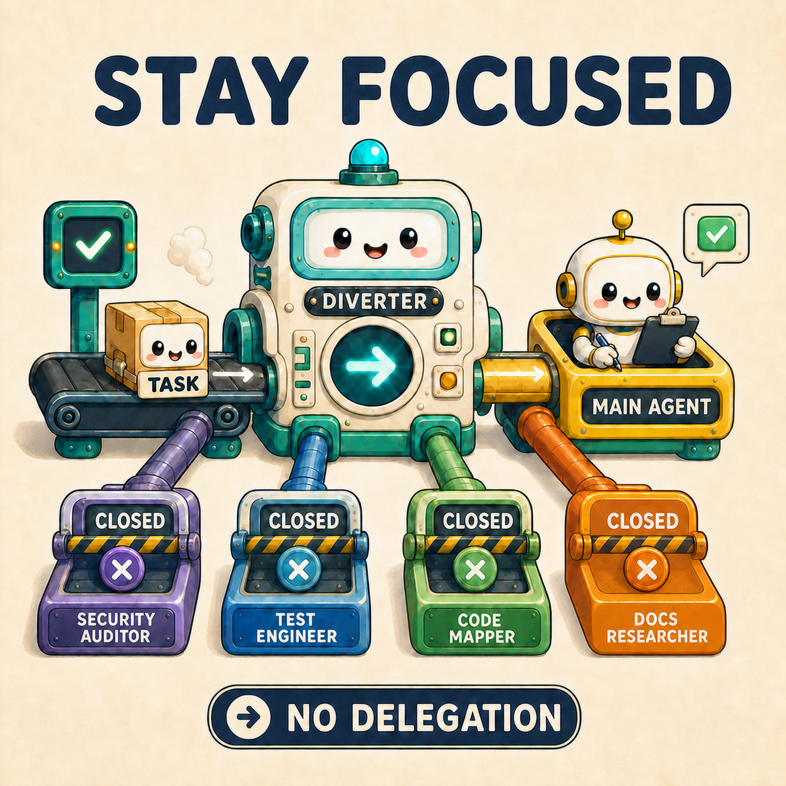
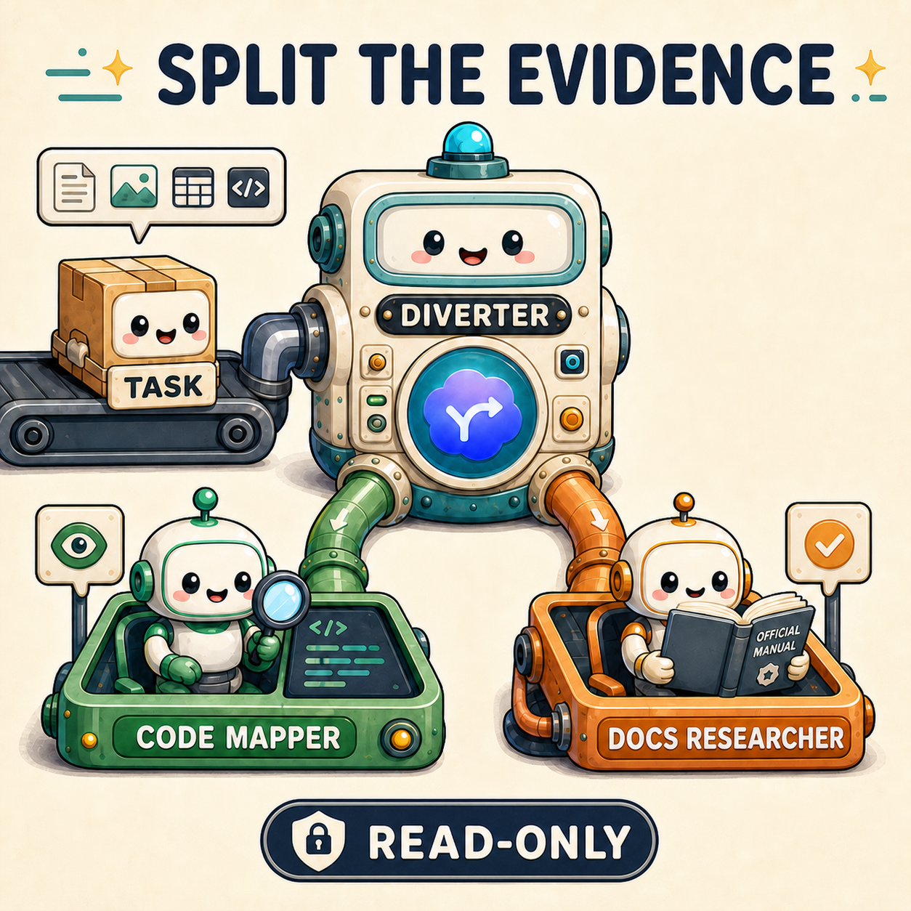

<p align="center">
  
</p>

<h1 align="center">Diverter</h1>

<p align="center">
  <a href="README.md">English</a> | <a href="README.zh.md">简体中文</a>
</p>

<p align="center">
  <a href="LICENSE"></a>
  <a href="https://github.com/openai/codex"></a>
  <a href="https://github.com/917Dhj/Diverter/stargazers"></a>
  <a href="https://github.com/917Dhj/Diverter"></a>
  <a href="https://github.com/917Dhj/Diverter"></a>
  
</p>

<p align="center">
  
</p>

Diverter 只在任务值得分派时，为 Codex 选择有边界的专业阵容；简单任务继续留在主线程。

## ✨ 让 Codex 更懂得如何分工

简单任务留在主线程，复杂任务交给合适的专家；该分派时才分派，每一次协作都守住边界。

<table>
  <tr>
    <td width="25%" align="center">
      <a href="assets/diverter-demo-stay-focused.png">
        
      </a>
    </td>
    <td width="25%" align="center">
      <a href="assets/diverter-demo-split-evidence.png">
        
      </a>
    </td>
    <td width="25%" align="center">
      <a href="assets/diverter-demo-bring-experts.png">
        
      </a>
    </td>
    <td width="25%" align="center">
      <a href="assets/diverter-demo-write-guardrails.png">
        
      </a>
    </td>
  </tr>
</table>

## 🚀 快速开始

1. 告诉 Codex：

   ```text
   请获取并按照这个安装说明执行：https://raw.githubusercontent.com/917Dhj/Diverter/refs/heads/main/.codex/INSTALL.md
   ```

2. 安装完成后打开 `/hooks`，检查并信任 Diverter 的 `SessionStart` Hook，然后新建或重新打开任务。

3. 新安装默认使用 `ask`。通过以下命令查看或修改用户级策略：

   ```text
   $diverter-mode status
   $diverter-mode auto
   $diverter-mode ask
   ```

| 策略 | 行为 |
|---|---|
| `ask` | 提议一个阵容，并在分派前等待批准 |
| `auto` | 告知一个阵容，并针对任意工作模式立即分派 |

策略变更在下一次 `SessionStart` 生效；重启或重新打开任务是最可预期的方式。`auto` 只改变分派授权的时机，不改变 Codex 权限、sandbox 或 handoff 写入边界。

## 🎭 角色

Diverter 内置十个专业子代理。安装器支持推荐组合（`code-mapper`、`docs-researcher`、`reviewer`、`security-auditor`、`test-engineer` 和 `test-automator`）、全部角色或自定义选择。

| 角色 | GPT-5.6 模型 | Reasoning effort | 功能 |
|---|---|---|---|
| `code-mapper` | `gpt-5.6-terra` | `high` | 追踪代码路径、符号和归属边界 |
| `search-specialist` | `gpt-5.6-luna` | `medium` | 收集聚焦的仓库或外部证据 |
| `docs-researcher` | `gpt-5.6-luna` | `high` | 核验官方 API、版本和文档保证 |
| `knowledge-synthesizer` | `gpt-5.6-luna` | `high` | 对齐冗长或互相冲突的结果 |
| `task-distributor` | `gpt-5.6-sol` | `medium` | 将宽泛目标拆成有边界的工作包 |
| `reviewer` | `gpt-5.6-sol` | `medium` | 审查正确性、回归和可维护性 |
| `security-auditor` | `gpt-5.6-sol` | `high` | 审计信任边界、密钥和 agent-tool 安全 |
| `test-engineer` | `gpt-5.6-luna` | `xhigh` | 针对行为和风险设计最小测试覆盖 |
| `test-automator` | `gpt-5.6-terra` | `xhigh` | 在行为明确后添加有边界的回归测试 |
| `web-performance-auditor` | `gpt-5.6-luna` | `xhigh` | 审计 Web 性能证据和 Core Web Vitals 风险 |

Diverter 先选择能力，再映射到 Codex 环境中实际可用的角色。首选角色缺失时会明确说明，不会静默替换。自定义角色集可以调整 [`role-lineups.md`](skills/diverter/references/role-lineups.md)。

## 🔄 工作模式

| 工作模式 | 边界 |
|---|---|
| `read-only` | 只检查和报告，不写入文件 |
| `mixed` | 先调查，再进行有边界的写入；除非路径明确互不重叠，可写代理保持串行 |
| `write-capable` | 只在显式 handoff 和 sandbox 范围内编辑 |

Diverter 在分派前始终明确标注一种工作模式。

## 🎯 Diverter 何时分派

在大多数 intelligence 档位下，子代理委派需要显式提出；Ultra 可以主动分派。Diverter 填补显式委派路径，并在原生主动委派拥有会话编排权时静默让路。参见 OpenAI 的[子代理文档](https://learn.chatgpt.com/docs/agent-configuration/subagents)。

| 会分派 | 留在主线程 |
|---|---|
| 多条独立工作线可以并行推进 | 任务简单或只有单一工作线 |
| 代码和官方文档需要分别核验 | 写入高度耦合，或必须先查清一个事实 |
| 安全、测试、性能或发布风险需要专业角色 | 用户明确退出，或请求仍然含糊 |

Diverter 会匹配用户的语言；角色名称和工作模式标记保持英文。

## ⚙️ 工作原理

1. `SessionStart` Hook 加载用户级委派策略并激活委派门控。
2. Diverter 先为原生主动委派让路；否则判断任务应留在主线程，还是选择一个不超过四个角色的阵容和一种工作模式。
3. `ask` 等待批准；`auto` 告知后立即分派。执行后端随后通过原生自定义 Agent 或临时叶子 `codex exec` worker 运行有边界的 handoff。

每个 handoff 都包含显式目标、范围、写入策略和可验证交付物。详见 [`delegation-contract.md`](skills/diverter/references/delegation-contract.md) 和 [`handoff-schema.md`](skills/diverter/references/handoff-schema.md)。

## 🙏 致谢

- 始终在线门控与 session-bootstrap 模式参考自 [obra/superpowers](https://github.com/obra/superpowers)。
- 内置角色包是对 [VoltAgent/awesome-codex-subagents](https://github.com/VoltAgent/awesome-codex-subagents) 的精选改编。
- 审查、安全、测试和 Web 性能角色的设计参考了 [addyosmani/agent-skills](https://github.com/addyosmani/agent-skills)。

## 🤝 贡献与许可

欢迎提交 Issue 和 Pull Request。有效的贡献可以改进任务形态规则、角色映射、正反例或评估场景。一条好的新规则应同时包含一个应该触发分派的提示，以及一个相似但应留在主线程的提示。

可以从 [`decision-rules.md`](skills/diverter/references/decision-rules.md)、[`role-lineups.md`](skills/diverter/references/role-lineups.md) 和 [`evals/scenarios.md`](evals/scenarios.md) 开始。

本项目基于 [MIT License](LICENSE) 发布。
